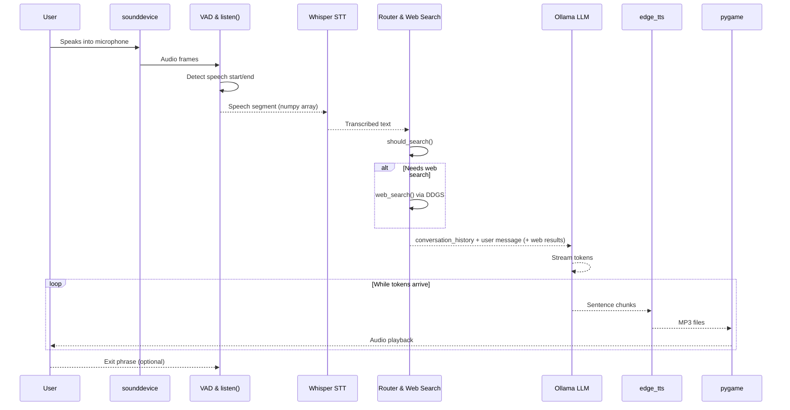

Jarvis Voice Assistant
======================

Jarvis is a local, privacy‑focused, real‑time **voice AI assistant** built in Python.  
It listens through your microphone, detects when you speak, transcribes speech with Whisper, optionally performs web search, generates answers using an Ollama LLM, and replies back using neural text‑to‑speech — all in a continuous, hands‑free loop.

---

Features
--------

- **Hands‑free voice assistant loop**
  - Always‑on listening with smart voice activity detection (VAD)
  - Auto‑starts with a spoken greeting: “Jarvis online. How can I help?”
- **High‑quality speech recognition**
  - Uses OpenAI Whisper (`medium` model by default) for accurate transcription
  - GPU acceleration when CUDA is available; otherwise CPU
- **Local LLM via Ollama**
  - Uses `qwen2.5:7b` (configurable) through Ollama’s `chat` API
  - Maintains short conversation history for contextual responses
- **Smart web search integration**
  - DuckDuckGo Search (`ddgs`) used when queries sound like “search”, “what is…”, “latest news”, etc.
  - Web results are passed as context to the LLM
- **Streaming TTS response**
  - Uses Microsoft Edge TTS (`edge_tts`)
  - Streams LLM output sentence‑by‑sentence to speech (minimal gaps)
  - Audio playback via `pygame`
- **Clean conversation management**
  - System prompt defines Jarvis’s persona and style
  - Conversation history truncated to keep performance stable
- **Graceful shutdown**
  - Voice exit commands: `"goodbye jarvis"`, `"shut down"`, `"exit"`, `"turn off"`
  - KeyboardInterrupt (`Ctrl+C`) safely stops the assistant

---

System Architecture
-------------------

### High‑Level Data Flow

```mermaid
flowchart LR
    User((User)) -->|Speaks| Mic[Microphone Input]
    Mic --> SD[sounddevice Stream]
    SD --> VAD[WebRTC VAD\n(webrtcvad)]
    VAD -->|Speech segment| STT[Whisper STT\n(whisper)]
    STT -->|Transcript| ROUTER{Should\nSearch?}
    ROUTER -->|Yes| SEARCH[Web Search\n(DDGS)]
    SEARCH --> CONTEXT[Augment User\nMessage]
    ROUTER -->|No| CONTEXT
    CONTEXT --> CHAT[LLM via Ollama\n(qwen2.5:7b)]
    CHAT -->|Token Stream| SPLIT[Sentence Splitter\n(regex)]
    SPLIT --> TTSQ[Async TTS Queue\n(edge_tts)]
    TTSQ --> TTS[MP3 Files]
    TTS --> PYGAME[Audio Playback\n(pygame.mixer)]
    PYGAME -->|Voice Reply| User
```

### Runtime Components

```mermaid
flowchart TB
    subgraph Audio_In[Audio Input & VAD]
        A1[sounddevice InputStream] --> A2[frame loop]
        A2 --> A3[is_speech()\n(webrtcvad)]
        A3 --> A4[ring_buffer + voiced_frames]
        A4 --> A5[Return speech audio\nnumpy array]
    end

    subgraph STT[Speech-to-Text]
        S1[transcribe(audio)] --> S2[whisper.load_model]\nmedium
    end

    subgraph Logic[Assistant Logic]
        L1[should_search(text)] --> L2[web_search(query)\nDDGS]
        L3[conversation_history]
    end

    subgraph LLM_TTS[LLM & Streaming TTS]
        P1[respond_streaming()] --> P2[Producer: ollama.chat(stream=True)]
        P2 --> P3[split_sentences()]
        P3 --> P4[generate_tts(text)\nedge_tts]
        P4 --> Q1[Async Queue]
        Q1 --> C1[Consumer: play_audio()\npygame.mixer]
    end
```

### Interaction Sequence



---

Project Structure
-----------------

- `main.py` – Entire Jarvis assistant implementation:
  - Configuration and constants
  - Model loading (Whisper, Ollama, VAD, TTS, audio)
  - Web search integration
  - Streaming LLM + TTS pipeline
  - Voice listening loop and shutdown logic

---

Requirements
------------

- **OS**: Windows 10 (tested; other platforms likely possible with adjustments)
- **Python**: 3.10+ recommended
- **Hardware**:
  - Working microphone
  - Speakers/headphones
  - Optional: NVIDIA GPU with CUDA for faster Whisper inference
- **Runtime dependencies (Python packages)**:
  - `whisper`
  - `sounddevice`
  - `numpy`
  - `torch`
  - `webrtcvad`
  - `ollama` (Python client)
  - `edge-tts`
  - `pygame`
  - `ddgs`
- **System dependencies**:
  - **FFmpeg** (required by Whisper/audio processing)
  - **Ollama** installed and running locally
  - Internet connection (for first model downloads, web search, Edge TTS)

You can capture these in a `requirements.txt` similar to:

```text
openai-whisper
sounddevice
numpy
torch
webrtcvad-wheels
ollama
edge-tts
pygame
ddgs
```

> Adjust package names/versions as needed for your environment.

---

Installation
------------

1. **Clone or download the project**
   ```bash
   git clone "<your-repo-url>.git"
   cd "Project 3"
   ```

2. **Create and activate a virtual environment (recommended)**
   ```bash
   python -m venv .venv
   .venv\Scripts\activate
   ```

3. **Install Python dependencies**
   ```bash
   pip install --upgrade pip
   pip install -r requirements.txt
   ```
   Or install packages manually using the list above.

4. **Install FFmpeg**
   - Download FFmpeg for Windows and add the `bin` folder to your `PATH`.
   - Verify:
     ```bash
     ffmpeg -version
     ```

5. **Install and set up Ollama**
   - Install from `https://ollama.com/` (GUI installer on Windows).
   - After installation, pull the model used in this project:
     ```bash
     ollama pull qwen2.5:7b
     ```
   - Ensure the Ollama service is running (usually automatic after install).

---

Estimated Download & Setup Time
-------------------------------

Actual times depend on your internet speed and hardware, but rough estimates:

- **Python packages**: a few hundred MB total  
  - 100 Mbps: ~1–3 minutes  
  - 20 Mbps: ~5–10 minutes
- **Whisper `medium` model**:
  - Size: ~1.4 GB (downloaded automatically on first use)
  - 100 Mbps: ~2–5 minutes  
  - 20 Mbps: ~10–20 minutes
- **Ollama model `qwen2.5:7b`**:
  - Size (compressed model files): several GB (commonly 4–8+ GB)
  - 100 Mbps: ~5–20 minutes  
  - 20 Mbps: ~20–60+ minutes
- **One‑time model compilation/warmup**:
  - First inference on CPU or GPU can take additional time for cache building.

After first‑time downloads, subsequent runs are much faster since models are cached locally.

---

Configuration
-------------

Key configuration values are defined at the top of `main.py`:

```python
WHISPER_MODEL       = "medium"
SAMPLE_RATE         = 16000
CHANNELS            = 1
VAD_AGGRESSIVENESS  = 2
FRAME_DURATION_MS   = 30
PADDING_DURATION_MS = 1200
MIN_SPEECH_DURATION = 0.5
LANGUAGE            = "en"

OLLAMA_MODEL        = "qwen2.5:7b"
TTS_VOICE           = "en-US-GuyNeural"
TTS_RATE            = "+15%"
```

You can customize:

- **Speech recognition**:
  - `WHISPER_MODEL`: e.g. `"base"`, `"small"`, `"medium"`, `"large"` etc.
  - `LANGUAGE`: change to your target language code.
- **VAD behavior**:
  - `VAD_AGGRESSIVENESS`: 0–3 (higher = more strict speech detection).
  - `MIN_SPEECH_DURATION`, `FRAME_DURATION_MS`, `PADDING_DURATION_MS`.
- **LLM model**:
  - `OLLAMA_MODEL`: any model installed in Ollama (e.g., `llama3:8b`, etc.).
- **TTS voice**:
  - `TTS_VOICE`: any valid Edge TTS voice ID.
  - `TTS_RATE`: speaking speed (e.g., `"+15%"`, `"-10%"`).

Search trigger phrases and exit commands are also configurable via:

```python
SEARCH_TRIGGERS = [...]
EXIT_COMMANDS   = [...]
```

---

How to Run & Use
----------------

1. **Start Ollama (if not already running)**
   - On Windows, Ollama usually starts automatically.
   - Verify with:
     ```bash
     ollama list
     ```

2. **Run Jarvis**
   ```bash
   python main.py
   ```

3. **Observe startup**
   - Console shows:
     - Device detection (`cuda` or `cpu`)
     - Whisper model loading
     - Ollama pre‑warming
   - Jarvis speaks: “Jarvis online. How can I help?”

4. **Interact by voice**
   - Speak naturally after you see:
     ```text
     Ready! Speak to Jarvis...
     ```
   - Jarvis will:
     - Detect your speech using WebRTC VAD.
     - Transcribe audio with Whisper.
     - Optionally run web search (if your query matches search triggers).
     - Stream a spoken answer back to you.

5. **Example things to say**
   - “What is the capital of France?”
   - “Search for the latest news about AI today.”
   - “Tell me about black holes.”
   - “What’s the weather like today in New York?” (relies on web search results)

6. **Exit the assistant**
   - Say any of:
     - “goodbye jarvis”
     - “shut down”
     - “exit”
     - “turn off”
   - Or press `Ctrl+C` in the terminal.

---

Future Enhancements
-------------------

Some ideas to extend this project:

- **GUI / Tray App**
  - Simple desktop UI with mute/unmute, status indicators, and logs.
- **Wake word detection**
  - Replace always‑on VAD with a wake word like “Hey Jarvis”.
- **Command plugins**
  - Structured intents for actions like:
    - Opening applications
    - Controlling media (play/pause/volume)
    - Managing files or automation scripts
- **Multi‑language support**
  - Automatic language detection and dynamic `LANGUAGE` switching.
  - Per‑language TTS voices.
- **Custom knowledge base**
  - Local documents (PDFs, notes) indexed with embeddings.
  - Hybrid web + local data retrieval.
- **Better logging & analytics**
  - Structured logs for queries, latencies, and error tracking.
- **Hotkey activation**
  - Global keyboard shortcut to toggle listening.

---

License
-------

Copyright © 2026  
**Moiz Baloch**

Permission is hereby granted, free of charge, to any person obtaining a copy  
of this software and associated documentation files (the "Software"), to deal  
in the Software without restriction, including without limitation the rights  
to use, copy, modify, merge, publish, distribute, sublicense, and/or sell  
copies of the Software, and to permit persons to whom the Software is  
furnished to do so, subject to the following conditions:

The above copyright notice and this permission notice shall be included  
in all copies or substantial portions of the Software.

THE SOFTWARE IS PROVIDED "AS IS", WITHOUT WARRANTY OF ANY KIND, EXPRESS OR  
IMPLIED, INCLUDING BUT NOT LIMITED TO THE WARRANTIES OF MERCHANTABILITY,  
FITNESS FOR A PARTICULAR PURPOSE AND NONINFRINGEMENT. IN NO EVENT SHALL THE  
AUTHORS OR COPYRIGHT HOLDERS BE LIABLE FOR ANY CLAIM, DAMAGES OR OTHER  
LIABILITY, WHETHER IN AN ACTION OF CONTRACT, TORT OR OTHERWISE, ARISING FROM,  
OUT OF OR IN CONNECTION WITH THE SOFTWARE OR THE USE OR OTHER DEALINGS IN  
THE SOFTWARE.

---

Credits
-------

- **Project Author & Primary Developer**: **Moiz Baloch**
- **Core technologies**:
  - Whisper (speech‑to‑text)
  - WebRTC VAD (`webrtcvad`)
  - Ollama (`qwen2.5:7b` model by default)
  - Microsoft Edge TTS (`edge-tts`)
  - DuckDuckGo Search (`ddgs`)
  - `sounddevice`, `pygame`, `torch`, and `numpy` for audio and ML foundations

