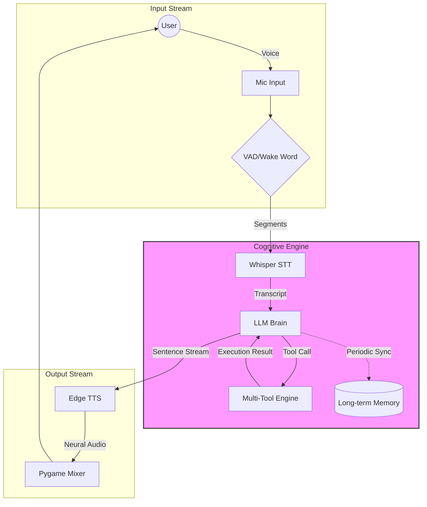

# 🎙️ Jarvis: The Agentic Voice Assistant

[](https://www.python.org/downloads/)
[](LICENSE)
[](https://ollama.com)

Jarvis is a high-performance, **local-first**, and privacy-focused **Agentic Voice AI Assistant**. Unlike traditional voice commands that follow rigid scripts, Jarvis utilizes a Large Language Model (LLM) "brain" to understand intent, manage complex conversation history, and execute a suite of over 40 specialized tools.

Whether you need to analyze a financial spreadsheet via voice, search the web for the latest global events, or automate system tasks, Jarvis acts as a bridge between natural language and your machine's power.

---

## 🌟 Capabilities at a Glance

- **🧠 Cognitive Reasoning**: Powered by Ollama (`qwen2.5` or `llama3.1`), Jarvis reasoning isn't limited to a list of commands. It understands context, sarcasm, and complex multi-part requests.
- **👂 Triple-Trigger Activation**: 
  - **Wake Word**: High-accuracy detection for "Hey Jarvis".
  - **Acoustic Signature**: Detects **double claps** for hands-free wake-up in environments where speaking isn't ideal.
  - **Dynamic VAD**: Uses WebRTC to distinguish between human speech and background noise.
- **📼 Semantic & Episodic Memory**: 
  - **Long-Term Facts**: Learns your name, preferences, and work details automatically.
  - **Conversation Recall**: Remembers what you discussed earlier in the day or week.
- **📊 Professional Data Suite**: 
  - **Voice-to-Spreadsheet**: "Jarvis, what's the average revenue in that sales CSV?"—It uses Pandas to analyze data on the fly.
  - **Notes Management**: Create, append, and search through a local knowledge base of text notes.
- **🌐 Real-Time Intelligence**: Integrates DuckDuckGo for live web searches, fetching webpage content, and providing concise summaries.
- **🔊 High-Fidelity Synthesis**: Streams audio via Microsoft Edge's neural voices for a human-like, low-latency response.

---

## 🏗️ Technical Architecture

### 🔄 The Agentic Loop

Jarvis doesn't just "reply." It enters a "Thought-Action-Observation" loop.



---

## 📂 System Philosophy & Structure

Jarvis is designed with a "One File, One Responsibility" modular approach:

- **`main.py`**: The central nervous system that coordinates the startup, pre-warming of models, and the primary active/idle switching logic.
- **`config.py`**: The single source of truth for all parameters—from microphone sample rates to the LLM's system personality.
- **`core/`**: The "Senses." Specialized drivers for audio capture (`listen.py`), transcription (`stt.py`), and speech synthesis (`tts.py`).
- **`agent/`**: The "Mind." Handles the agentic loop (`jarvis.py`), the RAG-based memory system (`memory.py`), and the extensive functional toolset (`tools.py`).

---

## ⚙️ Requirements & Prerequisites

### 💻 Hardware Requirements
*   **Audio**: A stable 16kHz microphone and speakers.
*   **Compute**: 
    *   *Minimum*: High-end CPU (8+ cores).
    *   *Recommended*: NVIDIA GPU with CUDA (8GB+ VRAM) for real-time performance.

### 💿 Software Dependencies
*   **Python 3.10+**
*   **Ollama**: External service for hosting local models.
*   **FFmpeg**: Critical for audio file handling and Whisper processing.

---

## 📦 Rapid Deployment

1.  **Environment Setup**
    ```powershell
    git clone https://github.com/igmoiiz/Speech-to-Text-Using-Whisper.git
    cd "Speech-to-Text-Using-Whisper"
    python -m venv venv
    .\venv\Scripts\activate
    ```

2.  **Installing Libraries**
    ```powershell
    pip install -r requirements.txt
    ```

3.  **Model Acquisition**
    ```powershell
    ollama pull qwen2.5:7b
    ```

4.  **Launch**
    ```powershell
    python main.py
    ```

---

## 🚦 Interaction Examples

*   **System Control**: *"Jarvis, take a screenshot of my work and set a reminder to finish it in 20 minutes."*
*   **Data Analysis**: *"Analyze the CSV file in my Downloads folder and give me a summary of the 'Total Profit' column."*
*   **Web Research**: *"Look up the latest price of Bitcoin and summarize the top three news articles from today."*
*   **Personal Knowledge**: *"Remember that my client meeting is moved to Friday at 3 PM."* (Later: *"When is my meeting?"*)

---

## 📜 License & Legal

This software is **Proprietary**. All rights are reserved by the author.

**Copyright © 2026 Moiz Baloch**

Unauthorized copying, distribution, or modification of this project is strictly prohibited without explicit written consent.

**To obtain a license or request usage permissions, please contact:**
- 📧 **Official Email**: moaiz3110@gmail.com
- 💬 **WhatsApp**: [+92 306 7892235](https://wa.me/923067892235)

---

## 👥 Acknowledgments & Credits

- **Project Visionary**: Moiz Baloch
- **Underlying Technologies**: Developed using OpenAI Whisper (Open Source), Microsoft Edge-TTS, Ollama, and WebRTC VAD.
